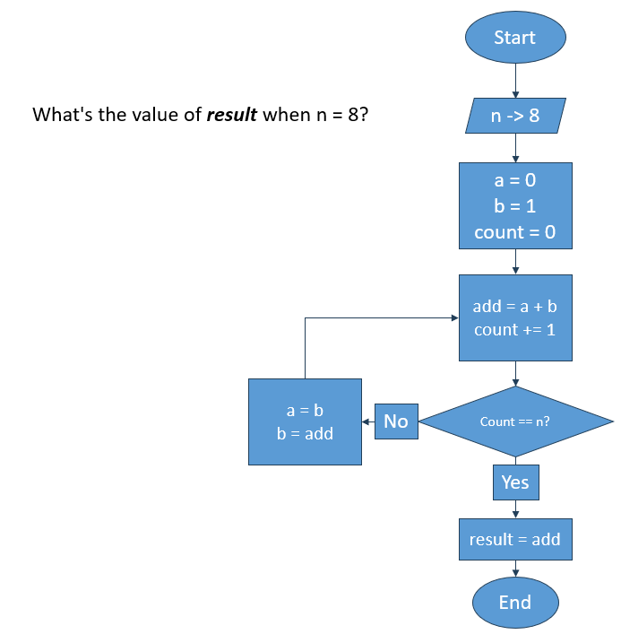

## Logica de Programacion
### Escenario 1

Determina el resultado del diagrama cuando `n = 8`: 34



### Escenario 2
Identifica los errores en el codigo siguiente:

```java 
 
import java.io.*;
 
class GFG {
    // Function to print N Fibonacci Number
    static void Fibonacci(int N)
    {
        int num1 = 0, num2 = 1;
 
        for (int i = 0; i < N; i++) {
            // Print the number
            System.out.print(num1 + " ");
 
            // Swap
            int num3 = num2 + num1;
            num1 = num2;
            num2 = num3;
        }
    }
 
    // Driver Code
    public static void main(String args[])
    {
        // Given Number N
        int n = 10;
 
        // Function Call
        Fibonacci(n);
    }
}
 

```
## Tablas de verdad
### Escenario

Se te proporcionará una tabla de verdad que describe el comportamiento lógico de una función. Escribe la función booleana simplificada a partir de la tabla (elige cualquiera de las tablas siguientes).


f(A,B,C,D) = ¬B + (B * ¬C) 


### EXTRA 
Representa el circuito lógico que implementa la función booleana simplificada.

## Linux Test

### Escenario
Se te pidio descargar un script y ejecutarlo para corroborar que funciona correctamente. Sin embargo, solo tienes acceso al OS desde la linea de comandos. 

En base al escenario anterior, responde los siguientese ejercicios

### Ejercicios

1. Necesitarás obtener el ejecutable de la url `https://example.com/executables/my_program.sh`. Escribe a continuacion tu script:

```bash
# TODO: Your answer here
curl -O https://example.com/executables/my_program.sh

chmod +x my_program.sh

ls -l my_program.sh

```
2. El binario funciona correctamente. Tu mision es moverlo para que sea ejecutable globalmente. Guiate en el siguiente diagrama para realizarlo:

```bash
/📂
├── 📂usr 
│   └── 📁local 
│       └── 📁bin # your program should be here
└── 📂home 
    └── 📁 user
        └── 📃 my_program.sh # your program is here
```

```bash
# TODO: Your answer here
sudo mv ~/my_program.sh /usr/local/bin/

sudo chmod +x /usr/local/bin/my_program.sh

ls -l /usr/local/bin/my_program.sh
```
### Puntos extra
3. Explica que acciones realizan los comandos que elegiste en ambos ejercicios

curl nos permite descargar archovos desde el ejecutable de url
chmod modifica los permisos del archivo y +x da permisos de ejecucion

ls imprime los archivos existentes en la direccion dada

sudo nos nos permite como super usuario mover los archivos

## Testing

Imagina que tienes como producto una bicicleta nueva. Se te ha encargado probar los frenos. Describe como harias una prueba para corroborar si funcionan correctamente. Indica tres parametros para validar su funcionamiento.
Volteas la bicicleta y le das vuletas a las ruedas, presionas el freno
1. debe frenar al momento
2. debe frenar
3. Los frenos deben estar en estado optimo
